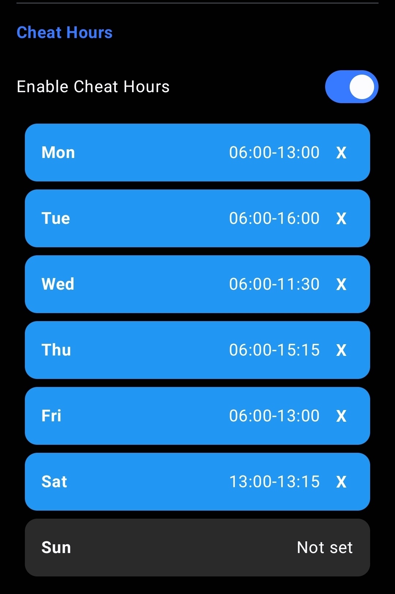
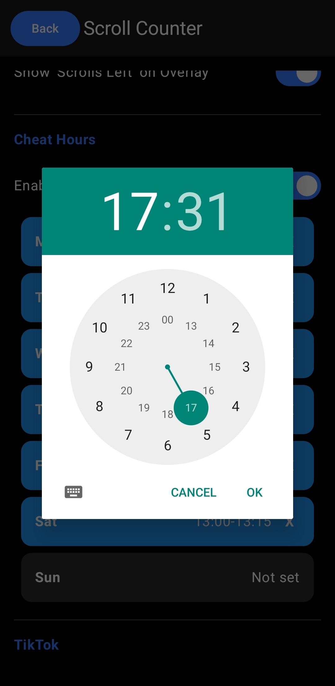

# blockEm
Custom app blocker/limiter aimed specifically to stop prolongued doomscrolling. Its currently specifically build around maximum scroll amount/day instead of the usual maximum time/day which is better system in my opinion.

### Tech Stack:
Built with bare Kotlin in Android Studio for Android 15+, theme using androids native material system.

## DOWNLOAD and SETUP
Go to [Releases](https://0ndyy.github.io/frutiger-os/) and download **app-release.apk** and run it.
The app asks for permissions, note that each system is different and i cant guarantee it will lead you automatically to correct page, but it should get you close.

## Feature List
*tip: click images to enlarge them*
### Daily Scroll Limit
Set maximum amount of scrolls/day before scrolling(not whole app) gets blocked

  
  

---

### Set Cheat Hours
Ability to set cheat hours independently for each day of the week(regular apps usually only allow set time for all days).

  
  

---

### Allowing apps/dms/homepages...
You can ignore friends reels, tiktok messages, instagram homepage posts or even whole apps

  

---

### Overview
See your progress through the whole month and discover scroll patterns

  

### Acknowledgement
This project was inspired by the now discontinued app [DigiPaws](https://github.com/nethical6/digipaws), which was missing few features i really wanted(day specific cheat hours, scroll limiter - not just counter, btw this is where i discovered this was possible, but in the end ended up using a different more robust system).
